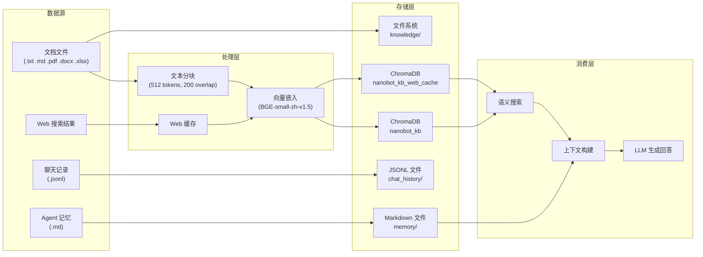

# Architecture: Agent-Oriented Data Governance

## 设计背景

### nanobot 数据流分析



### 识别的数据质量风险

| # | 风险 | 数据层 | 影响等级 | 治理措施 |
|---|------|--------|---------|---------|
| 1 | 重复摄入 | 向量库 | 高 | Hash/语义去重 |
| 2 | 空/过短 Chunk | 向量库 | 高 | 校验规则 + 过滤 |
| 3 | 编码损坏 | 文档/向量 | 中 | 编码检测 + 告警 |
| 4 | 路径不一致 | 元数据 | 中 | 路径标准化校验 |
| 5 | Web 缓存过期 | 向量库 | 中 | TTL 策略 + 自动清理 |
| 6 | 长期知识陈旧 | 文档 | 中 | 定期审查提醒 |
| 7 | 聊天记录损坏 | JSONL | 低 | JSON 校验 + 修复 |
| 8 | 记忆膨胀 | 文件系统 | 低 | 新鲜度追踪 + 归档 |
| 9 | 无数据血缘 | 全局 | 中 | 血缘追踪 |

## 治理框架设计

### 分层架构

```
┌──────────────────────────────────────────────┐
│              Agent API Layer                  │
│  ┌───────────────┐ ┌──────┐ ┌─────────────┐ │
│  │GovernanceToolkit│ │ CLI  │ │GovernanceFacade│
│  │  (nanobot tool) │ │      │ │ (Python API) │ │
│  └───────────────┘ └──────┘ └─────────────┘ │
├──────────────────────────────────────────────┤
│              Governance Engine                │
│  ┌─────────┐ ┌─────┐ ┌──────────┐ ┌───────┐│
│  │Profiler │ │Dedup│ │Validation│ │Fresh- ││
│  │         │ │     │ │          │ │ness   ││
│  └─────────┘ └─────┘ └──────────┘ └───────┘│
│  ┌─────────┐ ┌──────────┐                   │
│  │Lineage  │ │Reporter  │                   │
│  │         │ │+ Alerts  │                   │
│  └─────────┘ └──────────┘                   │
├──────────────────────────────────────────────┤
│              Core Models                      │
│  DataAsset, QualityReport, ValidationResult  │
│  LineageGraph, GovernanceConfig              │
├──────────────────────────────────────────────┤
│              Data Sources                     │
│  ChromaDB  │  Files  │  JSONL  │  Markdown   │
└──────────────────────────────────────────────┘
```

### 治理流水线

日常运行的推荐流水线:

```
1. health_check()          # 综合评估
   ├── profile_knowledge_base()  # 质量画像
   ├── validate_chunks()         # 规则校验
   ├── find_duplicates()         # 去重扫描
   └── check_freshness()         # 新鲜度扫描
       └── compute_health()      # 聚合评分
           └── check_alerts()    # 触发告警

2. (可选) remove_duplicates()    # 清理重复
3. (可选) archive/delete expired # 清理过期

结果:
├── .governance/health_history.jsonl  # 健康趋势
├── .governance/lineage.json          # 数据血缘
└── .governance/alerts.json           # 告警记录
```

### nanobot 集成方式

推荐两种集成模式:

#### 模式 A: Agent 工具集成
将治理工具注册为 nanobot 的工具，让 Agent 自主调用:
- Agent 可以在摄入文档前先 `governance_profile_document` 评估质量
- 定期通过 heartbeat 自动执行 `governance_health_check`
- 用户可以直接问 "检查知识库健康度" 来触发

#### 模式 B: Pipeline 集成
在 nanobot 的数据处理管道中嵌入治理检查:
- `knowledge_ingest` 前执行文档校验
- `knowledge_ingest` 后触发去重扫描
- `heartbeat` 周期执行健康检查
- Web 缓存写入时记录血缘

## 与企业级方案的对比

| 特性 | 本框架 | OpenMetadata | Great Expectations |
|------|--------|-------------|-------------------|
| 部署复杂度 | pip install | Docker + MySQL + ES | pip install |
| 适用场景 | 个人 AI 助手 | 企业数据平台 | 数据管道 |
| Agent 集成 | 原生支持 | 需定制 | 需定制 |
| ChromaDB 支持 | 原生支持 | 不支持 | 不支持 |
| 中文支持 | 原生 | 有限 | 无 |
| 资源占用 | < 50MB | > 2GB | < 200MB |

本框架借鉴了上述项目的设计理念（声明式规则、数据画像、血缘追踪），但针对 Agent + 知识库场景做了轻量化适配。
